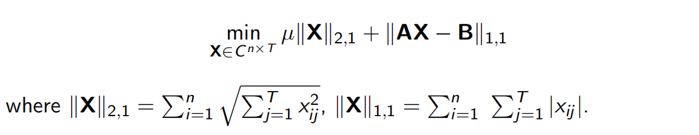

# 
Program Homework 1

## 1 优化问题描述

优化如下问题

特别地，我们取 T = 1，则问题转化为

## 2 算法原理

采用 ADMM 算法，算法原理如下：

其中，针对三个子问题，由于解空间为n维复数空间全体，所以我们令函数导数等于0，从而得到子问题的解

## 3 程序使用指南

### 3.1 IDE

Visual Studio 2019

### 3.2 平台工具集

Visual Studio 2019 (v142)

### 3.3 编程语言

C++

### 3.4 依赖库

Eigen

### 3.5 函数调用

最简单的调用方式为

程序会按照所给定的维数自动初始化所有需要的变量，包括 x ；并将最终的计算结果赋值给 x 本身。也可按如下方式对所有变量进行初始化

## 4 程序测试

### 4.1 二维测试情形

A = 

b = 

计算结果为

### 4.2 高维测试情形

A = 

b = 

计算结果为

### 4.2 更高维（1000维）测试情形

from

to

## 5 结论

该稀疏优化算法针对大规模矩阵的求解有着普遍高效的收敛效率，能够在几次迭代之后迅速得到最优解，是一个高效的优化算

## 6 其他测试

用户可随意选择初始矩阵和参数，进行进一步测试

## Enjoy it~

