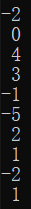

# <center>Program Homework 2</center>

## 1 优化问题描述

优化如下QP问题


## 2 算法原理

采用内点法中的障碍函数法，算法原理如下：

首先，我们将该问题中的 Gx-h 中的各行看作 fi(x)，将其放入对数函数并加入到优化函数中，原元问题转化为一个约束最优化问题


从而，我们只需要优化如下函数


其中


算法原理为


其中，第一步的优化我们采用非可行点牛顿法，其原理如下


其中，第一步的计算方法如下


## 3 程序使用指南

### 3.1 IDE

Visual Studio 2019

### 3.2 平台工具集

Visual Studio 2019 (v142)

### 3.3 编程语言

C++

### 3.4 依赖库

Eigen

openCV(可选，用于显示二维情形下的迭代轨迹)

### 3.5 函数调用

最简单的调用方式为


程序会按照所给定的维数自动初始化所有需要的变量，包括 x ；并将最终的计算结果赋值给 x 本身。也可按如下方式对所有变量进行初始化


## 4 程序测试

### 4.1 二维测试情形

P = 

Q = 

r = 

G = 

h = 

A = 

b = 

计算结果为


准确解为 (7/3, 8/3)，迭代误差是由于停机准则造成，尝试过多种停机准则，都不太理想，应该是由于机器误差导致在迭代过程中对 tao = 0.49, alpha < 1.024e-16 有如下断言成立

```c++
1.0 - tao * alpha == 1
```

因此只好暂时选择单次求解时间 >5s 则视为求解结束

### 4.2 高维测试情形

P = 

Q = 

r = 

G = 

h = 

A = 

b = 

计算结果为


### 4.2 更高维（500维）测试情形


## 5 结论

障碍函数内点法可以很好地满足约束条件并很快地收敛到最优解，在规模很小的时候可以很高效地得到QP问题的最优解

## 6 其他测试

用户可随意选择初始矩阵和参数，进行进一步测试

## Enjoy it~

